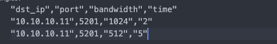

## Network Simulator

Here I use iperf to simulate the network traffic.


#### Install

Install iperf both on the receiver and the sender part

When installing iperf3(the python module), the problem about not installing may occur. Try `ldconfig`.


#### Usage

Modify the cotent in config.csv



Fill in the required information row by row. Notice that bandwidth's unit is KB.

Then the client will send the traffic following the pattern specified in "config.csv" one by one


#### Run

```
python3 traffic_generator.py
```

